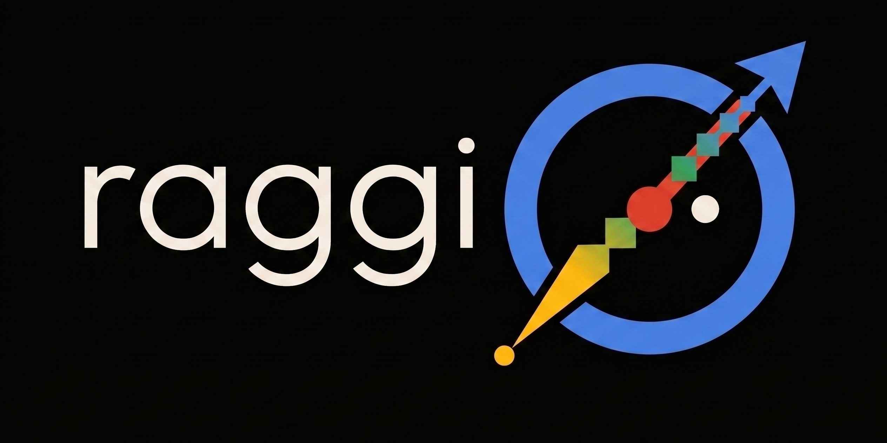

# raggio



Containerized RAG vector store built on
[turbovec](https://github.com/RyanCodrai/turbovec). One container, one REST
API, and everything a retrieval backend needs without an external database.

**Why raggio**: a plug-and-play vector database for companies and
individuals that don't want a commercial hosted service and don't want to
hand-roll FAISS — raggio is faster anyway
([benchmarks vs FAISS](https://github.com/RyanCodrai/turbovec) on the turbovec
page, the engine raggio runs on). It runs in a single container
with limited resources yet holds lots of documents: TurboQuant 4-bit
quantization shrinks vector indexes ≈8x, and collections are offloaded to disk
instead of kept always in memory, so stored data isn't bounded by RAM.

- **Hybrid search** — vector (cosine over quantized turbovec indexes), text
  (BM25 via SQLite FTS5), or both fused with Reciprocal Rank Fusion. The
  client picks the mode per request.
- **Durable async ingest** — documents are journaled to SQLite before the API
  acknowledges them; interrupted jobs replay after a crash.
- **Physically separate collections** — each collection has its own vector
  index, metadata database, and optional API key: hand every user or team a
  key and they share one deployment without complex auth, physically unable
  to touch each other's collections.
- **Bigger than RAM** — collections are disk-backed and loaded/evicted with an
  LRU policy, so total stored data can far exceed container memory.
- **Fits where big databases don't** — when running LLM inference locally,
  every byte of RAM is precious: it's needed for model weights and KV cache,
  with no room to waste, and raggio gives you a local, high-performance RAG
  DB with the smallest possible footprint. The same small footprint serves
  multi-user deployments in resource-constrained environments — an SME, a
  single department — where a big-scale database makes no sense.
- **Embeddings optional** — ingest pre-computed vectors from your own
  pipeline, or point raggio at any OpenAI-compatible `/embeddings` endpoint
  (OpenAI, Azure AI Foundry, local servers) and it embeds text server-side.

## At a glance

```bash
podman build -t raggio .
podman run -p 8000:8000 -v raggio-data:/data \
  -e ROOT_API_KEY=change-me \
  -e EMBEDDING_BASE_URL=https://api.openai.com/v1 \
  -e EMBEDDING_API_KEY=sk-... \
  -e EMBEDDING_MODEL=text-embedding-3-small \
  raggio
```

The `EMBEDDING_*` vars are optional — skip them and ingest pre-computed
vectors instead (the hybrid text-query example below uses them).

```bash
curl :8000/collections/docs/search -H "x-api-key: $KEY" --json '{
  "query": {"text": "acme pricing terms"},
  "mode": "hybrid",
  "k": 5}'
```

## Where to go next

- [Getting started](getting-started.md) — run the container and create your
  first collection.
- [Search](search.md) — the three search modes, tokenizers, filters, and
  result expansion.
- [Vector indexing](indexing.md) — the optional IVF index: when it pays off
  (multi-million collections) and how to attach or remove one.
- [API reference](api.md) — every endpoint, request, and response.
- [Storage & durability](storage.md) — what's on disk and what survives a
  crash.
- [Benchmarks](benchmark.md) — 550k real embeddings in a 1 GiB container,
  measured against Weaviate.
